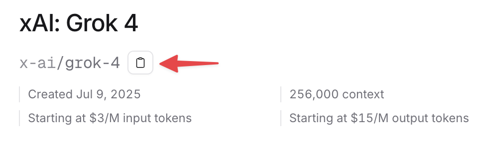

# Introduction

This guide, designed for the MEPI and DESG 2025 graduate courses at Universidad de los Andes (Chile), explains and provides practical examples for getting started with LLM usage through APIs. For this purpose, we'll use [OpenRouter](https://openrouter.com), a service that allows access to a wide variety of models through a single API key and SDK, facilitating experimentation and iteration.

In the examples, we'll use Python, but you can replicate the steps in most programming languages. Official OpenRouter documentation [here](https://openrouter.ai/docs/quickstart).


## Step 1: Create an account and obtain an API key
- Go to `https://openrouter.ai` and create an account.
- Navigate to Dashboard → API Keys → Create.
- Copy your key and store it in a secure place (used for authentication with the service).
    - Recommendation: <span style="color: red; font-weight: bold;">set a spending limit ($) on your API key in case it gets compromised.</span>

> ⚠️ Security: If someone obtains your API key, they'll be able to make requests to the API at your expense. Always store it in a `.env` file and don't share it. If it gets leaked, delete it and create a new one. Never upload it to Git or public repositories.


## Step 2: Create a .env file

In your project root, create a file called `.env` with your key:

```bash
# .env
OPENROUTER_API_KEY=sk-or-xxxxxxxxxxxxxxxx
```

## Step 3: Install packages 

```bash
pip install openai python-dotenv requests
```

## Step 4: Let's get started
OpenRouter exposes an OpenAI-compatible API, so we can use the same Python library by changing the base URL.

```python
# file: hello_openrouter.py
from openai import OpenAI
from dotenv import load_dotenv
import os

load_dotenv()
client = OpenAI(
    base_url="https://openrouter.ai/api/v1",
    api_key=os.getenv("OPENROUTER_API_KEY")
)

resp = client.chat.completions.create(
    model="openai/gpt-5-nano",  # Change to your preferred model
    messages=[{"role": "user", "content": """
    
           I want a random fact 
           about the history of medicine. 
    
    
    """}],

)
print(resp.choices[0].message.content)
```

### How to run

```bash
python hello_openrouter.py
```


### Example output

> In ancient India, Sushruta, considered the father of surgery, describes in the Sushruta Samhita rhinoplasty (nose surgery) using a forehead skin flap to reconstruct the nose, one of the first recorded reconstructive surgical techniques. Would you like another historical medical fact?


## Step 5: Structured responses (JSON)

In this section, we'll see how to ask the model for a response in a strictly structured format (e.g., JSON). This makes it easier to validate, store, and consume the results from your code. We'll describe the required response in JSON format and then parse it in Python to use it directly.

```python
import json
from openai import OpenAI
from dotenv import load_dotenv
import os

client = OpenAI(
    base_url="https://openrouter.ai/api/v1",
    api_key=os.getenv("OPENROUTER_API_KEY")
)

resp = client.chat.completions.create(
    model="google/gemini-2.5-flash",  
    messages=[{"role": "user", "content": """
    
           I want a random fact 
           about the history of medicine. 

            I want the result to be a JSON with the following structure:
               {
               "title": "string",
               "date": "string",
               "description": "string",
               "protagonist": "string"
               }
    
    
    """}],
    response_format={
        "type": "json_object",
        "json_schema": {
            "name": "MedicalEvent",
            "strict": True,
            "schema": {
                "type": "object",
                "properties": {
                    "title": {"type": "string"},
                    "date": {"type": "string"},
                    "description": {"type": "string"},
                    "protagonist": {"type": "string"}
                },
            }
        }
    }
)

json_content = resp.choices[0].message.content
data = json.loads(json_content)
print(data)
```

### Example output
```json
{
  "title": "Discovery of penicillin",
  "date": "1928",
  "description": "In 1928, Alexander Fleming observed that a mold of the genus Penicillium notatum contaminated a Staphylococcus aureus culture plate and that, around the mold, bacterial growth stopped. This finding led to the isolation of penicillin, the first antibiotic, and marked the beginning of the antibiotic era.",
  "protagonist": "Alexander Fleming"
}
```


There's a more modern and clearer way to use structured outputs, available since the OpenAI API. If you want to know more, you can click [here](https://platform.openai.com/docs/guides/structured-outputs)


## Final comments

### How to choose a model

In the [models](https://openrouter.ai/models) section of OpenRouter you have the complete list of available models, with filters by provider, capability and cost. To test one, change the `model` parameter in the examples to the exact model identifier (for example, `openai/gpt-4o-mini`, `anthropic/claude-3-haiku`, etc.). Make sure to paste the name exactly as it appears to maintain consistency with the OpenRouter API.
Model rankings, both by token usage, market share and categories in the [rankings](https://openrouter.ai/rankings) section of OpenRouter.





### Security

- Store keys in `.env` and never in code.
- If leaked, rotate the key immediately.
- Use a system prompt if you want to control tone, format or clinical approach.
- Log the model ID and key parameters to be able to reproduce results.
- Avoid pasting sensitive patient or third-party data in prompts.

