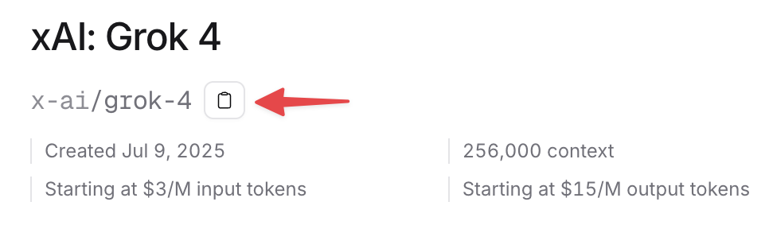

# Introducción

Esta guía, pensada para los cursos de posgrado MEPI y DESG 2025 de la Universidad de los Andes (Chile), explica y deja ejemplos prácticos para introducirnos en el uso de LLMs a través de APIs. Para ello utilizaremos [OpenRouter](https://openrouter.com), un servicio que permite acceder a una gran variedad de modelos mediante una API key y un único SDK, facilitando la experimentación e iteración.

En los ejemplos usaremos Python, pero puedes replicar los pasos en la mayoría de los lenguajes. Documentación oficial de OpenRouter [aquí](https://openrouter.ai/docs/quickstart).


## Paso 1: Crear una cuenta y obtener una API key
- Ingresa a `https://openrouter.ai` y crea una cuenta.
- Ve a Dashboard → API Keys → Create.
- Copia tu clave y guárdala en un lugar seguro (se usa para autenticarte con el servicio).
    - Recomendación: <span style="color: red; font-weight: bold;">configura un límite de gasto ($) a tu API key por si se ve comprometida.</span>

> ⚠️ Seguridad: Si alguien obtiene tu API key, podrá hacer solicitudes a la API a tu cargo. Guárdala siempre en un archivo `.env` y no la compartas. Si se filtra, elimínala y crea otra. Nunca la subas a Git ni a repositorios públicos.


## Paso 2: Crea un archivo .env

En la raíz de tu proyecto, crea un archivo llamado `.env` con tu clave:

```bash
# .env
OPENROUTER_API_KEY=sk-or-xxxxxxxxxxxxxxxx
```

## Paso 3: Instala los paquetes 

```bash
pip install openai python-dotenv requests
```

## Paso 4: Manos a la obra
OpenRouter expone una API compatible con OpenAI, así que podemos usar la misma librería de Python cambiando la URL base.

```python
# archivo: hola_openrouter.py
from openai import OpenAI
from dotenv import load_dotenv
import os

load_dotenv()
client = OpenAI(
    base_url="https://openrouter.ai/api/v1",
    api_key=os.getenv("OPENROUTER_API_KEY")
)

resp = client.chat.completions.create(
    model="openai/gpt-5-nano",  # Cambia por el modelo que prefieras
    messages=[{"role": "user", "content": """
    
           Quiero un dato aleatorio 
           sobre la historia de la medicina. 
    
    
    """}],

)
print(resp.choices[0].message.content)
```

### Cómo ejecutar

```bash
python hola_openrouter.py
```


### Ejemplo de output

> En la India antigua, Sushruta, considerado el padre de la cirugía, describe en el Sushruta Samhita la rinoplastia (cirugía de la nariz) utilizando un colgajo de piel de la frente para reconstruir la nariz, una de las primeras técnicas quirúrgicas reconstructivas registradas. ¿Quieres otro dato histórico de la medicina?


## Paso 5: Respuestas estructuradas (JSON)

En esta sección veremos cómo pedirle al modelo una respuesta en un formato estrictamente estructurado (por ejemplo, JSON). Esto facilita validar, almacenar y consumir los resultados desde tu código. Describiremos la respuesta requerida en formato JSON y luego lo parsearemos en Python para usarlo directamente.

```python
import json
from openai import OpenAI
from dotenv import load_dotenv
import os

client = OpenAI(
    base_url="https://openrouter.ai/api/v1",
    api_key=os.getenv("OPENROUTER_API_KEY")
)

resp = client.chat.completions.create(
    model="google/gemini-2.5-flash",  
    messages=[{"role": "user", "content": """
    
           Quiero un dato aleatorio 
           sobre la historia de la medicina. 

            Quiero que el resultado sea un JSON con la siguiente estructura:
               {
               "título": "string",
               "fecha": "string",
               "descripción": "string",
               "protagonista": "string"
               }
    
    
    """}],
    response_format={
        "type": "json_object",
        "json_schema": {
            "name": "EventoMedico",
            "strict": True,
            "schema": {
                "type": "object",
                "properties": {
                    "titulo": {"type": "string"},
                    "fecha": {"type": "string"},
                    "descripción": {"type": "string"},
                    "protagonista": {"type": "string"}
                },
            }
        }
    }
)

json_content = resp.choices[0].message.content
data = json.loads(json_content)
print(data)
```

### Ejemplo de output
```json
{
  "título": "Descubrimiento de la penicilina",
  "fecha": "1928",
  "descripción": "En 1928, Alexander Fleming observó que un moho del género Penicillium notatum contaminó una placa de cultivo de Staphylococcus aureus y que, alrededor del moho, el crecimiento bacteriano se detenía. Este hallazgo llevó al aislamiento de la penicilina, el primer antibiótico, y marcó el inicio de la era de los antibióticos.",
  "protagonista": "Alexander Fleming"
}
```


Hay una manera más moderna y clara de utilizar structured outputs, disponible desde la API de OpenAI. En caso de querer saber más, puedes hacer clíck [aquí](https://platform.openai.com/docs/guides/structured-outputs)


## Comentarios finales

### Cómo elegir un modelo

En la sección de [modelos](https://openrouter.ai/models) de OpenRouter tienes la lista completa de modelos disponibles, con filtros por proveedor, capacidad y costo. Para probar uno, cambia el parámetro `model` en los ejemplos por el identificador exacto del modelo (por ejemplo, `openai/gpt-4o-mini`, `anthropic/claude-3-haiku`, etc.). Asegúrate de pegar el nombre tal como aparece para mantener la consistencia con la API de OpenRouter.





### Seguridad

- Guarda las claves en `.env` y nunca en el código.
- Si se filtra, rota la clave inmediatamente.
- Usa un prompt de sistema si quieres controlar tono, formato o enfoque clínico.
- Registra el ID del modelo y los parámetros clave para poder reproducir resultados.
- Evita pegar datos sensibles de pacientes o terceros en los prompts.


